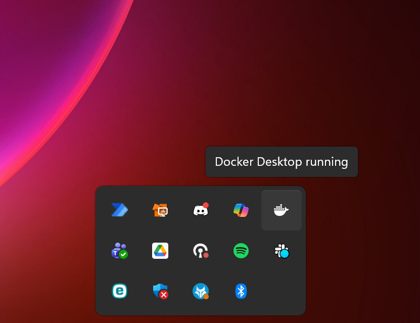
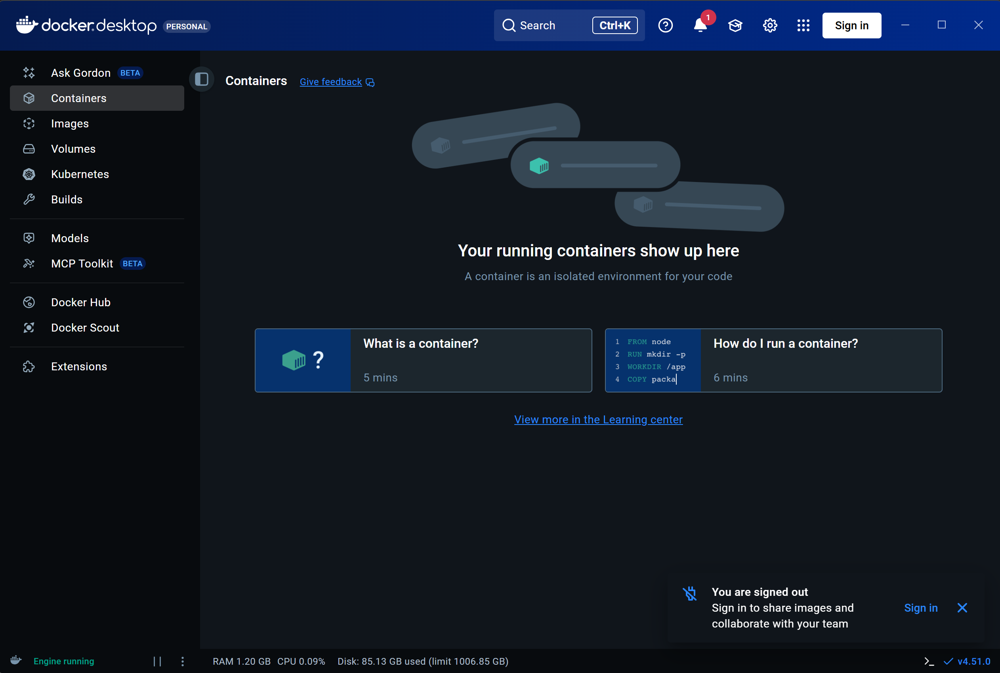
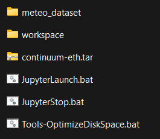
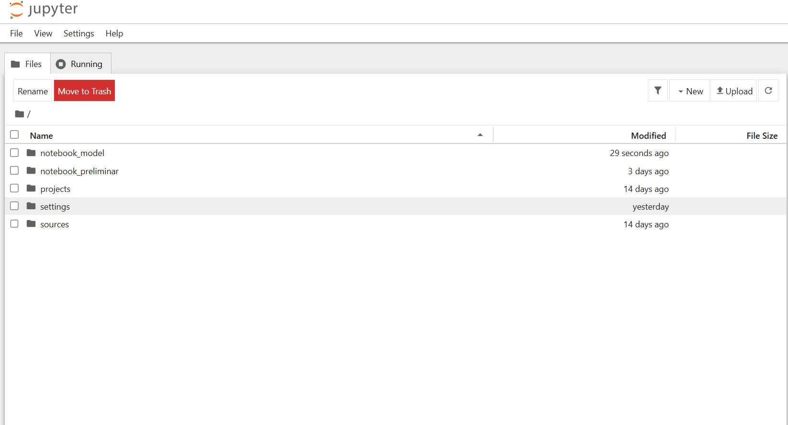

Continuum Training Environment User Guide
===========================================

The following documentation reports all the required steps to setup your machine to follows 
HMC Tranings, organized by CIMA foundation.

Software setup
---------------------------------------------
Before starting the training a setup is required in order to have the correct tools available.

In particular the software required are :

- A recent web browser (Chrome, Edge, Firefox, [..])
- Docker
- Windows Subsystem for Linux (WSL), required by docker itself

All other software dependencies and installations are managed through a docker image which the instructor supplied on site, including experimental data.
In the following we will refer to those as **Trainings assets**.

Docker installation
_____________________________________________

To install Docker the main steps are hereby reported. 
Please open a Powershell terminal with administrator privilege.

 .. figure:: ./_static/01_PowerShell.png

First check the installation of WSL: ::

    wsl --version

If the output looks similar to the following WSL is already installed on your machine : ::

    WSL version: 2.5.9.0
    Kernel version: 6.6.87.2-1
    WSLg version: 1.0.66
    MSRDC version: 1.2.6074
    Direct3D version: 1.611.1-81528511
    DXCore version: 10.0.26100.1-240331-1435.ge-release
    Windows version: 10.0.26200.7171

Otherwise a fresh installation is required, execute the following commands ::

    wsl --install

    wsl --update

The prerequisites are now in place and you can proceed with Docker installation.

Download the latest version of docker from the following link:

`Docker Desktop Installer for Windows <https://desktop.docker.com/win/main/amd64/Docker%20Desktop%20Installer.exe?utm_source=docker&utm_medium=webreferral&utm_campaign=docs-driven-download-win-amd64>`_

For your convenience you can also refer to `Docker official installation guide <https://docs.docker.com/desktop/setup/install/windows-install/>`_

Execute the installer, you will be prompted for a restart of the machine. After restarting the setup is now complete.

Form the tray you now see a new icon

Double click the icon and the Docker Desktop GUI will shows up:

Check setup
_____________________________________________
Please open a Powershell and check docker installation dy raising the following command::
    
    docker info

If the setup is correct you should obtain some details like::
    
    Client:
        Version:           28.4.0
        API version:       1.51
        Go version:        go1.24.7
        Git commit:        d8eb465
        Built:             Wed Sep  3 20:59:40 2025
        OS/Arch:           windows/amd64
        Context:           desktop-linux

        Server: Docker Desktop 4.46.0 (204649)
        Engine:
        Version:          28.4.0
        API version:      1.51 (minimum version 1.24)
        Go version:       go1.24.7
        Git commit:       249d679
        Built:            Wed Sep  3 20:57:37 2025
        OS/Arch:          linux/amd64
        Experimental:     false
        containerd:
        Version:          1.7.27
        GitCommit:        05044ec0a9a75232cad458027ca83437aae3f4da
        runc:
        Version:          1.2.5
        GitCommit:        v1.2.5-0-g59923ef
        docker-init:
        Version:          0.19.0
        GitCommit:        de40ad0

Load assets for the training
----------------------------------------------
The instructor has provided all students a usb stick with the content shown in figure

In the detail:

- meteo_dataset: contains ERA5 and CHIRPS over all the period
- workshpace: cointains the static model data and some local datasets for Ethiopia
- continuum-eth.tar is the runtime setup for the exercise
- JupyterLaunch.bat/JupyterStop.bat are utilities for launch and stop the training utilities
- Tools-OptimizeDiskSpace.bat is a tool for optimize disk space if Docker occupy too much space.

The students should copy on their laptop in a dedicated folder all, except the "meteo_dataset" folder (it is very big, better to copy only the needed data)

Load the runtime environment
__________________________________________
Open Docker Desktop, skip the login phase and minimize to tray.
Open a terminal in the folder where the "continuum-eth.tar" file has been copied (right-click and then "Open in terminal").
To load such assets please raise the following command::

    docker load -i continuum-eth.tar

It might takes some time. After the process is complete you should see the following message ::
    
    Loaded image: continuum-eth:latest

In order to check the actual loading use the following command::

    docker image ls

From the list you should see now a new image named **continuum-eth:latest**

Start the container
____________________________________________
To start the training you can double click on the **JupyterLaunch.bat** file.
After some seconds the internet browser should open and show the notebook environment.
If not, you can manually open a web browser and navigate to `localhost:8888 <http://localhost:8888>`_

You should now see a notebook python served by the container:

The setup is up and running, keep attention high and enjoy the training!

